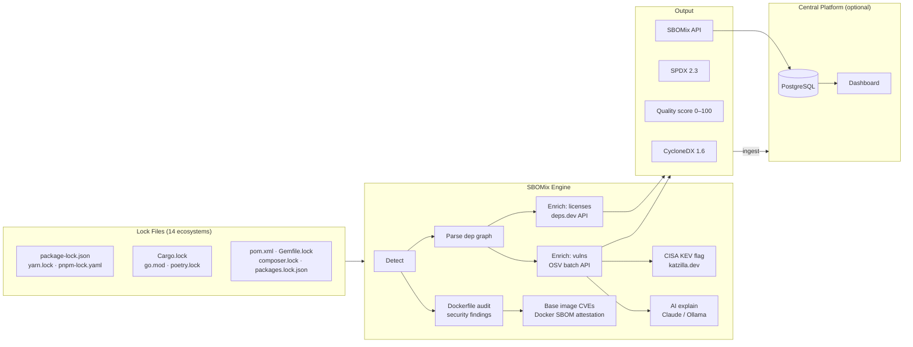

<div align="center">
  

  <h1>SBOMix</h1>

  <p><strong>Generate CycloneDX, SPDX, and AI-BOM from any project in one command.</strong></p>

  [](https://www.npmjs.com/package/sbomix)
  [](https://github.com/RunTimeAdmin/sbomix/actions/workflows/ci.yml)
  [](https://github.com/RunTimeAdmin/sbomix/actions/workflows/sbom.yml)
  [](LICENSE)
  [](https://cyclonedx.org)
  [](https://spdx.dev)
</div>

```bash
npx sbomix RunTimeAdmin/myapp@v2.1.0
```

Produces **CycloneDX 1.6**, **SPDX 2.3**, and **AI-BOM** in under 500ms. No Docker. No agents. No config files.

> **☁️ Prefer it hosted?** Skip the Postgres setup. [**sbomix.com**](https://sbomix.com) is the managed platform: a web dashboard, CVE blast-radius search across every repo, AI-BOM, and SBOM history. Free plan, paid from $19/mo with a 14-day trial. [**Get started free →**](https://api.sbomix.com/register)

---

## Quick Start

```bash
# Scan a GitHub repo at a specific tag
npx sbomix owner/repo@v1.2.0

# Scan the current directory
npx sbomix .

# Scan a local directory
npx sbomix ./my-project

# Private repo (uses $GITHUB_TOKEN automatically)
npx sbomix owner/private-repo

# Diff two SBOMs: see what changed between releases
npx sbomix diff old.cyclonedx.json new.cyclonedx.json

# Check for forbidden/restricted licenses
npx sbomix . --license-check

# Skip vulnerability lookup (faster, offline-safe)
npx sbomix owner/repo --no-vulns

# AI remediation advice (Anthropic Claude Haiku by default, EU/US data residency)
EXPLAIN_API_KEY=sk-ant-... npx sbomix . --explain

# AI explain with CISA KEV context: flags actively-exploited vulns
EXPLAIN_API_KEY=sk-ant-... KATZILLA_API_KEY=kz_... npx sbomix . --explain

# Self-hosted via Ollama (no vulnerability data sent to a cloud LLM)
EXPLAIN_BASE_URL=http://localhost:11434/v1 EXPLAIN_MODEL=llama3.2 npx sbomix . --explain
```

Output files written to the current directory:
```
bom.cyclonedx.json   ← CycloneDX 1.6
bom.spdx.json        ← SPDX 2.3
aibom.json           ← AI-BOM (only when AI/ML components are detected)
```

---

## How It Works



Lock files are the resolved dependency graph: authoritative, deterministic, and exact. SBOMix reads them directly instead of walking the filesystem, which is why it returns in milliseconds where filesystem scanners take tens of seconds (60–187× in the benchmarks below, which run Syft and Trivy via Docker).

---

## Why SBOMix

| | SBOMix | Syft | Trivy |
|---|---|---|---|
| **Speed** | **268–463ms** | 9–28s | 10–87s |
| **Approach** | Lock-file parsing | Filesystem scan | Filesystem + image scan |
| **Transitives** | Full graph | Partial | Partial |
| **Dep graph** | ✅ | ✅ | ❌ |
| **Zero config** | ✅ | ❌ | ❌ |
| **GitHub URL** | ✅ | ❌ | ❌ |
| **SBOM diff** | ✅ | ❌ | ❌ |
| **License policy** | ✅ | ❌ | ❌ |
| **VEX support** | ✅ | ❌ | ❌ |
| **Central repo** | ✅ | ❌ | ❌ |
| **CISA KEV flag** | ✅ | ❌ | ❌ |
| **AI remediation** | ✅ | ❌ | ❌ |
| **Dockerfile audit** | ✅ | ❌ | ❌ |
| **Base image CVEs** | ✅ (no Docker) | ❌ | ✅ (requires Docker) |
| **AI-BOM** | ✅ | ❌ | ❌ |

### Benchmark Results

| Repo | Ecosystem | SBOMix | Syft | Trivy |
|------|-----------|--------|------|-------|
| `nestjs/nest` | npm | **463ms** | 27 731ms | 86 550ms |
| `BurntSushi/ripgrep` | Rust | **268ms** | 11 823ms | 15 425ms |

`psf/requests` was dropped from this table: `requests` doesn't commit a lock file for its own runtime dependencies, so the only `requirements.txt` SBOMix finds is `docs/requirements.txt` (a single Sphinx pin for the documentation build). The 251ms figure was real, but it wasn't measuring what the table implied. A verified Python entry with a genuine multi-dependency lock file will be added back once one is found — many popular Python libraries don't commit lock files by convention, since that's a decision left to the consuming application.

Syft and Trivy run via Docker in this benchmark, adding ~3–5s of startup overhead. Native installs would be somewhat faster, but still an order of magnitude slower on lock-file repos. Reproduce with `npm run bench`.

---

## Features

### SBOM Generation
Produces fully-spec-compliant CycloneDX 1.6 and SPDX 2.3 with all CISA 2025 minimum elements: component name, version, supplier, purl, cryptographic hashes, license identifiers, dependency relationships, author, timestamp, and tool metadata.

### Vulnerability Enrichment
Every component is checked against the [OSV database](https://osv.dev) in a single batch call. Severity, CVSS score, and fix version are included in the SBOM output.

### License Compliance
```bash
npx sbomix . --license-check
```
Categorises each component's license as **permissive**, **notice**, **restricted** (weak copyleft, review required), or **forbidden** (strong copyleft). Exits `1` if any forbidden license is found. Produces a license compliance score 0–100.

### SBOM Diffing
```bash
npx sbomix diff v1.0.0.cyclonedx.json v1.1.0.cyclonedx.json
```
Shows exactly what changed between two releases: components added/removed/updated, and new or resolved vulnerabilities. Exits `1` if new vulnerabilities were introduced. Available both as a CLI command and via the API (`GET /api/v1/apps/:name/diff`).

### VEX Support
Mark vulnerabilities as `not_affected`, `fixed`, `affected`, or `under_investigation` via the API. `not_affected` statements suppress vulns from risk reports, keeping dashboards signal-rich.

### AI-BOM

No standard SBOM tool inventories your AI/ML stack. SBOMix does. When AI or ML components are detected (model files, HuggingFace packages, PyTorch, TensorFlow, LangChain, Transformers, MCP server configs), SBOMix generates a third output alongside the SBOM:

```
aibom.json
```

The AI-BOM captures everything an auditor or regulator needs to assess AI supply-chain risk:

- **Model provenance**: source, commit SHA, HuggingFace Hub metadata, SHA-256 hash of local weight files
- **Training data lineage**: dataset identity, version, and licensing
- **EU AI Act Annex IV fields**: purpose, intended use, capability description, risk classification
- **ISO 42001 control mapping**: 8 Annex A controls mapped to BOM evidence, with gap identification
- **Agentic context**: MCP server inventory, tool authority scope, and a **Least Agency Score** (0–100) measuring agent blast radius
- **Tamper-evident lineage**: a SHAKE-256 hash chain over model and data lineage, with an optional Ed25519 or post-quantum (ML-DSA) signature when you supply signing keys

**Sample output**

```json
{
  "bomFormat": "SBOMix-AIBOM",
  "specVersion": "sbomix-aibom/1.0",
  "generatedAt": "2026-06-27T10:00:00Z",
  "subject": { "name": "my-app", "version": "1.4.0" },
  "summary": {
    "aiModels": 1, "apiProviders": 1, "frameworks": 3,
    "mcpServers": 2, "leastAgencyScore": 38,
    "criticalThreats": 1, "highThreats": 2
  },
  "threats": [
    {
      "id": "AI-001", "severity": "CRITICAL",
      "name": "Unsafe serialization (pickle)",
      "component": "model.pt",
      "finding": "pytorch_model.bin uses Python pickle, which executes arbitrary code at load time"
    },
    {
      "id": "AI-009", "severity": "HIGH",
      "name": "Excessive agency (broad tool authority)",
      "finding": "filesystem MCP server scoped to /; violates Least Agency Principle"
    }
  ],
  "agentic": {
    "mcpServers": 2,
    "boundaries": { "leastAgencyScore": 38, "issues": ["filesystem root access", "unpinned npx server"] }
  },
  "compliance": {
    "summary": { "total": 14, "satisfied": 9, "gaps": 5, "coveragePct": 64 }
  },
  "lineageVerification": { "verified": true, "algorithm": "SHAKE-256" }
}
```

`aiModels` counts local weight files (`.pt`, `.safetensors`, `.pkl`, `config.json`) — these carry provenance and RCE risk. `apiProviders` counts external-API integrations (`openai`, `anthropic`, `boto3`) — these carry data-residency and availability risk. The two are separate inventory categories with different threat profiles.

**Threat catalogue**

SBOMix assesses 12 AI-specific supply-chain threats that no standard SBOM scanner catches:

| ID | Severity | Threat |
|----|----------|--------|
| AI-001 | CRITICAL | Unsafe pickle serialization (`.pt`/`.bin` executes arbitrary code at load time) |
| AI-002 | HIGH | Model weights with no integrity proof (tampered weights change behaviour silently) |
| AI-003 | HIGH | Unverified training data (data-poisoning backdoors survive to production) |
| AI-004 | MEDIUM | Missing model provenance (cannot trace artifact to a published registry entry) |
| AI-005 | HIGH | Unpinned `from_pretrained()` (model changes upstream without any code change) |
| AI-006 | MEDIUM | Restrictive model license: RAIL, CC-BY-NC, Llama community (legal risk in production) |
| AI-007 | LOW | External AI API dependency (provider outage or policy change breaks production) |
| AI-008 | HIGH | Uncontrolled fine-tuning pipeline (insider can retrain with poisoned data and redeploy) |
| AI-009 | HIGH | Excessive agent authority: broad filesystem/shell MCP violates Least Agency Principle (OWASP 2026) |
| AI-010 | MEDIUM | Unpinned MCP server via `npx`/`uvx` (tool code changes between runs with no review) |
| AI-011 | MEDIUM | Unauthenticated networked MCP server |
| AI-012 | LOW | System-prompt / agent-rule files (unversioned behaviour-control surface) |

**Compliance mapping**

The AI-BOM maps evidence to 14 controls across ISO/IEC 42001:2023 and the EU AI Act:

| Control | Regime | What it checks |
|---------|--------|----------------|
| A.7.2 | ISO 42001 | Training data provenance and quality |
| A.7.4 | ISO 42001 | Data provenance recording per data source |
| A.6.2.4 | ISO 42001 | Verification and validation records before deployment |
| A.6.2.6 | ISO 42001 | Model version promoted to production |
| A.10.2 | ISO 42001 | Third-party model, dataset, and AI service inventory |
| A.10.3 | ISO 42001 | Supply-chain risk assessment for pretrained models |
| A.6.2.8 | ISO 42001 | Agent authority scope (Least Agency) |
| Art. 12(1) | EU AI Act | Automatic event log over the system's lifetime |
| Art. 12(2) | EU AI Act | Tamper-evident lineage linking outputs to model and data versions |
| Art. 12(3) | EU AI Act | Cryptographic identification of dataset and model versions |
| Art. 15 | EU AI Act | Controls against model and data tampering |
| Art. 53(1)(a) | EU AI Act | GPAI technical documentation (architecture, parameters) |
| Art. 53(1)(c) | EU AI Act | Copyright policy and lawful dataset use |
| Art. 53(1)(d) | EU AI Act | Training content summary and dataset inventory |

Each control in the `compliance.controls` array carries the specific evidence found (or not found), so an auditor sees exactly what was checked and why a control is satisfied or a gap:

```json
{
  "control": "EUAIACT:Art12.3",
  "regime": "EU AI Act (Reg. 2024/1689)",
  "title": "Article 12(3) — Recording of reference data and version identification",
  "expects": "cryptographic identification of dataset and model versions",
  "status": "gap",
  "detail": "lineage not cryptographically signed"
}
```

The `summary.disclaimer` field in the output states explicitly: "Evidence-to-control mapping only. Not a certification or legal conformity assessment." Controls map what the BOM can observe to what the standard requires. Gaps point at missing documentation, not failing controls.

Add `--aibom-format yaml` to write `aibom.yaml` instead of JSON. When no AI/ML components are detected, no AI-BOM file is written and the `aibom-path` action output is omitted.

### CISA KEV Enrichment
Every vulnerability is automatically cross-referenced against the [CISA Known Exploited Vulnerabilities catalog](https://www.cisa.gov/known-exploited-vulnerabilities-catalog) (1,600+ entries, refreshed daily). Vulns on the KEV list are flagged `kev: true` in the database and surfaced in the AI explain output as highest priority. Being actively exploited in the wild is categorically different from a theoretical CVSS score.

Requires `KATZILLA_API_KEY` ([katzilla.dev](https://katzilla.dev)). The catalog is fetched once at API startup then refreshed every 24 hours. New vulns are cross-referenced immediately at ingest time without waiting for the refresh cycle.

### AI Remediation Advice
```bash
# Default: Anthropic Claude Haiku (EU/US data residency)
EXPLAIN_API_KEY=sk-ant-... npx sbomix . --explain

# Self-hosted via Ollama (no vulnerability data sent to a cloud LLM)
EXPLAIN_BASE_URL=http://localhost:11434/v1 EXPLAIN_MODEL=llama3.2 npx sbomix . --explain
```
After scanning, sends your vulnerability list to the configured AI provider and returns:
- 2–3 sentence plain-English risk summary
- Prioritised upgrade plan ordered by impact (most vulns resolved per change first)
- Specific mitigation guidance for vulns with no fix available
- CISA KEV callouts for actively-exploited entries

Default provider is **Anthropic Claude Haiku** (vulnerability data stays in EU/US jurisdiction). For self-hosted or offline use, run Ollama locally; a fully offline scan also needs `--no-vulns --no-licenses --no-docker`, since enrichment otherwise queries OSV, deps.dev, and the Docker/HuggingFace registries. Any OpenAI-compatible endpoint is supported via `EXPLAIN_BASE_URL` + `EXPLAIN_API_KEY` + `EXPLAIN_MODEL`.

Available both as a CLI flag (`--explain`) and as a REST endpoint (`POST /api/v1/apps/:name/explain`). Requires `EXPLAIN_API_KEY` (or a localhost `EXPLAIN_BASE_URL` for Ollama). The API endpoint returns `501` if not configured.

### Dockerfile Security Audit

SBOMix automatically detects and audits every `Dockerfile` in your project tree (including `Dockerfile.prod`, `Dockerfile.dev`, etc.) and reports security findings alongside the SBOM:

| Rule | Severity | What it catches |
|------|----------|-----------------|
| `unpinned-base-image` | HIGH | `:latest` tag or no tag |
| `no-digest-pin` | MEDIUM | tag present but no `@sha256:...` digest |
| `explicit-root-user` | HIGH | `USER root` or `USER 0` |
| `no-user-directive` | MEDIUM | no `USER` directive (defaults to root) |
| `secret-in-env` | HIGH | `ENV`/`ARG` with password/token/secret keyword |
| `add-instead-of-copy` | LOW | `ADD` used for plain file copies |
| `no-healthcheck` | LOW | no `HEALTHCHECK` directive |

Multi-stage builds are detected. Use `--no-docker` to skip Dockerfile scanning entirely.

### Base Image CVE Lookup

For Docker Official Images (`node`, `nginx`, `python`, `ubuntu`, etc.), SBOMix pulls the SBOM attestation directly from the Docker Hub OCI registry and queries OSV for known CVEs, with no Docker installation required.

```
Dockerfile  ·  2 MEDIUM  1 LOW  · multi-stage
  [MEDIUM] no-digest-pin:1  Base image 'node:20-alpine' has no digest pin
  base: node:20-alpine  ·  32 CVEs
32 base-image CVEs
```

How it works:
1. Anonymous OAuth token from Docker Hub auth service
2. Fetch the OCI image index (multi-platform manifest list)
3. Locate the linux/amd64 SBOM attestation entry
4. Pull the in-toto statement blob containing the SPDX 2.3 package list
5. Batch-query OSV for CVEs across all OS packages

Base image components appear in the CycloneDX output as `type: container` with `pkg:docker/library/node@20-alpine` PURLs. If no SBOM attestation is available (private or older images), the lookup returns `no CVE data` gracefully without failing the pipeline.

### Quality Score
Every SBOM gets a completeness score (0–100) measuring alignment with CISA 2025 minimum elements: purl coverage, hash coverage, license coverage, and lock-file fidelity.

### Agent Trust Report (`--profile crypto-agent`)
```bash
npx sbomix . --profile crypto-agent
```
Adds two artifacts alongside the normal scan output: `agent-trust-report.json` and a standalone, print-to-PDF `agent-trust-report.html`. Built for teams answering "what's in the agent that holds our keys" — an exchange questionnaire, an investor diligence request, or an internal review before granting an agent signing authority.

The report covers:
- **MCP tool surface** — every detected MCP server, its transport, auth, version-pinning, and authority scope (shell access, filesystem breadth), reusing the same detection and Least Agency Score behind the AI-BOM's agentic threats (AI-009 through AI-012).
- **Signing surface** — dependencies that hold or use private keys (EVM, Solana, Bitcoin, Cosmos, Polkadot, hardware wallets, cloud KMS clients), plus `.env` variable *names* that look like key material. Values are never read — the scanner only ever regex-matches variable names.
- **Known-bad / typosquat check** — exact-match against a versioned list (ships empty; this is a curation task, not something SBOMix invents) plus a naming-proximity check against well-known signing library names.
- **Compliance mapping** — EU AI Act Art. 11/Annex IV and OWASP Agentic AI Top 10 (ASI04) references, framed as documentation alignment, not certification.

Every report carries a canonical SHA-256 (`integrity.manifestSha256`) computed after stripping volatile fields (timestamps, report ID, CycloneDX serial number), so the same commit produces the same hash across runs — a tamper-evidence baseline, not a signature. This is presence detection and static inventory, not a code audit, a security rating, or a legal opinion.

**Also available without the CLI**, once an app has an SBOM on [sbomix.com](https://sbomix.com): the dashboard's app detail screen has an "Agent Trust Report ▾" button (JSON or HTML), and the same data is a REST call away at `GET /api/v1/apps/:name/agent-trust-report?format=json|html`. The hosted report is built from the app's already-stored SBOM, so it has one gap the CLI doesn't: no filesystem access means `.env` scanning is skipped, and the report says so explicitly (`envScanPerformed: false`) rather than reporting a clean scan it never ran. Run the CLI locally for full signing-surface coverage. In CI, set `profile: crypto-agent` on the Action (see below) to generate the report and get MCP/signing-surface counts in the PR comment.

---

## GitHub Action

```yaml
name: SBOM

on:
  push:
    branches: [main]
  pull_request:

permissions:
  contents: read
  pull-requests: write

jobs:
  sbom:
    runs-on: ubuntu-latest
    steps:
      - uses: actions/checkout@v4

      - name: SBOMix
        uses: RunTimeAdmin/sbomix@v1
        with:
          format: both
          fail-on-critical: true
          upload-artifact: true
```

On every pull request, SBOMix will:
- Generate CycloneDX 1.6 + SPDX 2.3 SBOMs
- Post a summary comment to the PR with vulnerability count and quality score
- Upload SBOMs as artifacts with 90-day retention
- Block merge if critical vulnerabilities are found

### Action Inputs

| Input | Default | Description |
|-------|---------|-------------|
| `format` | `both` | `both` · `cyclonedx` · `spdx` |
| `output-dir` | `sbom` | Directory to write SBOM files |
| `fail-on-critical` | `true` | Exit 1 if critical vulnerabilities found |
| `upload-artifact` | `true` | Upload SBOMs as GitHub Actions artifacts |
| `skip-vulns` | `false` | Skip OSV enrichment (faster, offline-safe) |
| `api-url` | `""` | SBOMix central API endpoint |
| `api-key` | `""` | SBOMix API key (`secrets.SBOMIX_API_KEY`) |
| `directory` | `.` | Directory to scan |
| `aibom-format` | `json` | AI-BOM output format: `json` or `yaml` |
| `profile` | `""` | `crypto-agent` — adds an Agent Trust Report (MCP tool surface, signing surface, known-bad match); PR comment shows a flag summary |

### Action Outputs

| Output | Description |
|--------|-------------|
| `cyclonedx-path` | Path to generated CycloneDX 1.6 BOM |
| `spdx-path` | Path to generated SPDX 2.3 BOM |
| `component-count` | Total components enumerated |
| `vulnerability-count` | Total known vulnerabilities |
| `critical-count` | Critical severity vulnerabilities (CVSS ≥ 9.0) |
| `quality-score` | SBOM completeness score 0–100 |
| `agent-trust-report-json-path` | Path to the Agent Trust Report JSON manifest (only with `profile: crypto-agent`) |
| `agent-trust-report-html-path` | Path to the Agent Trust Report HTML (only with `profile: crypto-agent`) |
| `aibom-path` | Path to generated AI-BOM (only present when AI/ML components are detected) |
| `ai-model-count` | Number of AI/ML model components detected |
| `ai-threat-count` | Number of AI/ML threats detected |

### With Central Tracking

```yaml
      - name: SBOMix
        uses: RunTimeAdmin/sbomix@v1
        with:
          format: both
          fail-on-critical: true
          upload-artifact: true
          api-url: ${{ vars.SBOMIX_API_URL }}
          api-key: ${{ secrets.SBOMIX_API_KEY }}
```

When `api-url` and `api-key` are set, SBOMs are automatically pushed to your SBOMix central instance for org-wide tracking. Upload failures do not fail the build.

---

## Supported Ecosystems

| Ecosystem | Lock File | Transitives | Notes |
|-----------|-----------|-------------|-------|
| **npm** | `package-lock.json` v1/v2/v3 | ✅ Full graph | Hoisting-aware resolver |
| **npm** | `pnpm-lock.yaml` v6/v9 | ✅ Full graph | Peer suffix handling |
| **npm** | `yarn.lock` v1 | ✅ Full graph | |
| **Python** | `poetry.lock` | ✅ Full graph | |
| **Python** | `Pipfile.lock` | ✅ Full graph | |
| **Python** | `requirements.txt` | ⚠️ Direct only | Warns on missing transitives |
| **Rust** | `Cargo.lock` | ✅ Full graph | SHA-256 checksums |
| **Go** | `go.mod` + `go.sum` | ✅ Full graph | Direct/indirect detection |
| **Java** | `pom.xml` | ✅ + `mvn` transitives | Resolves `${property}` vars |
| **Java** | `gradle.lockfile` | ✅ Full graph | Requires `--write-locks` |
| **.NET** | `packages.lock.json` | ✅ Full graph | SHA-512 hashes |
| **Ruby** | `Gemfile.lock` | ✅ Full graph | SHA-1 checksums via Bundler |
| **PHP** | `composer.lock` | ✅ Full graph | Licenses from package metadata |
| **Swift** | `Package.resolved` | ⚠️ Direct only | Git SHA hashes |
| **Dart/Flutter** | `pubspec.lock` | ⚠️ Direct only | SHA-256 hashes |

Monorepos are supported. SBOMix recurses up to 4 directories deep and deduplicates lock files per directory.

---

## CLI Reference

```
sbomix <source> [options]
sbomix diff <from> <to> [options]

Arguments:
  source                Local path, owner/repo[@ref], or https://github.com/... URL

Scan options:
  -o, --out <dir>       Output directory (default: current directory)
  -n, --name <name>     Project name override
  -v, --ver <version>   Version override
  -a, --author <org>    Author or organisation name
  --token <token>       GitHub token for private repos (or set $GITHUB_TOKEN)
  --format <fmt>        both | cyclonedx | spdx  (default: both)
  --profile <name>      crypto-agent — adds an Agent Trust Report (MCP + signing surface)
  --license-check       Flag forbidden/restricted licenses; exit 1 if any found
  --explain             AI remediation advice via Claude by default (requires EXPLAIN_API_KEY)
  --no-vulns            Skip OSV vulnerability enrichment
  --no-licenses         Skip deps.dev license enrichment
  --no-docker           Skip Dockerfile audit and base image CVE lookup
  --no-recursive        Do not recurse into subdirectories
  --json                Print summary as JSON (machine-readable, for CI)

Diff options:
  --json                Machine-readable JSON diff output
```

### Exit Codes

| Code | Meaning |
|------|---------|
| `0` | Success |
| `1` | Critical vulnerabilities found, or forbidden license detected (`--license-check`) |
| `2` | Fatal error: no lock files, clone failed, or unrecoverable parse error |

---

## Output Formats

### CycloneDX 1.6
```json
{
  "bomFormat": "CycloneDX",
  "specVersion": "1.6",
  "components": [
    {
      "type": "library",
      "name": "express",
      "version": "4.18.2",
      "purl": "pkg:npm/express@4.18.2",
      "licenses": [{ "license": { "id": "MIT" } }],
      "hashes": [{ "alg": "SHA-512", "content": "..." }],
      "scope": "required"
    }
  ],
  "dependencies": [
    { "ref": "pkg:npm/express@4.18.2", "dependsOn": ["pkg:npm/accepts@1.3.8"] }
  ],
  "vulnerabilities": [
    {
      "id": "GHSA-rv95-896h-c2vc",
      "ratings": [{ "score": 7.5, "severity": "high", "method": "CVSSv3" }],
      "affects": [{ "ref": "pkg:npm/express@4.18.2" }]
    }
  ]
}
```

### SPDX 2.3
```json
{
  "spdxVersion": "SPDX-2.3",
  "packages": [...],
  "relationships": [
    {
      "spdxElementId": "SPDXRef-express-4.18.2",
      "relationshipType": "DEPENDS_ON",
      "relatedSpdxElement": "SPDXRef-accepts-1.3.8"
    }
  ]
}
```

Both formats include all CISA 2025 minimum elements, full transitive dependency relationships, cryptographic hashes, SPDX license identifiers, and OSV vulnerability data.

---

## Central Platform (Self-Hosted)

> Don't want to run this yourself? The same platform is available fully managed at [sbomix.com](https://sbomix.com). No Postgres, no server, free to start.

The SBOMix API server answers org-wide questions like:

> "Which of our apps are exposed to CVE-2021-44228, and do any of them have a fix available?"

```mermaid
flowchart TD
    subgraph ci["CI/CD (GitHub Actions)"]
        A[SBOMix Action] -->|POST /ingest| B
    end

    subgraph api["SBOMix API"]
        B[Ingest endpoint]
        C[Search endpoint]
        D[Report endpoint]
        E[VEX endpoint]
        F[Diff endpoint]
        P[Explain endpoint\n(Claude / Ollama)]
    end

    subgraph db["PostgreSQL"]
        G[(organizations)]
        H[(sboms)]
        I[(components)]
        J[(vulnerabilities\n+ kev flag)]
        K[(vex_statements)]
        L[(app_latest_sboms)]
        M[(kev_catalog\nCISA KEV)]
    end

    B --> G & H & I & J & L
    C --> I & J & K
    D --> L & J & K
    E --> K
    F --> H
    P --> J & M
```

### Start the API

```bash
# With Docker (recommended)
cp .env.example .env      # set HMAC_SECRET and POSTGRES_PASSWORD
docker compose up -d
```

API available at `http://localhost:3080`.

### Key Endpoints

| Method | Path | Description |
|--------|------|-------------|
| `POST` | `/api/v1/ingest` | Ingest a new SBOM (called by the Action) |
| `GET` | `/api/v1/apps` | List all apps with risk summary |
| `GET` | `/api/v1/apps/:name/diff` | Diff latest two SBOMs for an app |
| `GET` | `/api/v1/search?cve=CVE-...` | Which apps are exposed to this CVE? |
| `GET` | `/api/v1/report` | Org-wide risk report |
| `POST` | `/api/v1/apps/:name/explain` | AI vulnerability summary + remediation plan |
| `POST` | `/api/v1/vex` | Add a VEX statement |
| `GET` | `/api/v1/vex` | List VEX statements |
| `POST` | `/api/v1/keys` | Issue a scoped API key |
| `GET` | `/api/v1/apps/:name/agent-trust-report?format=json\|html` | Agent Trust Report for the app's latest SBOM — built server-side from stored data (no filesystem access, so `.env` scanning is skipped and marked as such, not silently reported clean) |

See [`src/api/schema.sql`](src/api/schema.sql) for the full database schema.

---

## Development

```bash
git clone https://github.com/RunTimeAdmin/sbomix
cd sbomix
npm install

npm test          # unit tests (no external deps)
npm run e2e       # integration tests (requires docker compose up -d)
npm run bench     # benchmark vs Syft and Trivy
node bin/sbomix.js . --no-vulns   # run the CLI locally
```

### Project Structure

```
sbomix/
├── bin/sbomix.js           CLI entry point (scan + diff subcommands)
├── src/
│   ├── pipeline.js         Orchestration: detect → parse → enrich → generate
│   ├── diff.js             SBOM diffing: components and vulnerabilities
│   ├── licensePolicy.js    License tier classification and compliance scoring
│   ├── component.js        Shared component model + purl generation
│   ├── github.js           GitHub URL parsing + shallow clone
│   ├── osv.js              OSV vulnerability enrichment (batch API)
│   ├── kev.js              CISA KEV catalog sync (katzilla.dev, daily refresh)
│   ├── explain.js          AI remediation advice (Claude Haiku by default; any OpenAI-compatible provider)
│   ├── licenses.js         License enrichment (deps.dev API)
│   ├── basevuln.js         Base image CVE lookup via Docker SBOM attestations (OCI + OSV)
│   ├── parsers/
│   │   ├── npm.js          package-lock.json v1/v2/v3, yarn.lock
│   │   ├── pnpm.js         pnpm-lock.yaml v6/v9
│   │   ├── python.js       poetry.lock, Pipfile.lock, requirements.txt
│   │   ├── cargo.js        Cargo.lock
│   │   ├── golang.js       go.mod + go.sum
│   │   ├── maven.js        pom.xml
│   │   ├── gradle.js       gradle.lockfile
│   │   ├── dotnet.js       packages.lock.json (NuGet)
│   │   ├── ruby.js         Gemfile.lock
│   │   ├── php.js          composer.lock
│   │   ├── swift.js        Package.resolved
│   │   ├── dart.js         pubspec.lock
│   │   ├── detect.js       Lock file detection + deduplication; Dockerfile discovery
│   │   ├── dockerfile.js   Dockerfile static security audit (7 rules, no Docker required)
│   │   └── index.js        Parser dispatcher
│   ├── generators/
│   │   ├── cyclonedx.js    CycloneDX 1.6 generator + validator
│   │   └── spdx.js         SPDX 2.3 generator
│   └── api/
│       ├── server.js       Express API server
│       ├── db.js           PostgreSQL connection pool + transaction helper
│       └── schema.sql      Database schema
├── deploy/
│   ├── sbomix-nginx.conf   nginx vhost (HTTP → HTTPS proxy)
│   ├── push-and-run.sh     Deploy helper script
│   └── vps-setup.sh        VPS bootstrap script
├── tests/
│   ├── parsers.test.js     Parser unit tests
│   └── fixtures/           Sample lock files (all 14 ecosystems)
├── examples/
│   └── github-workflow.yml Annotated copy-paste workflow
└── action.yml              GitHub Action definition
```

### Adding a New Ecosystem

1. Write `src/parsers/<ecosystem>.js`: export a `parse*` function returning `Component[]`
2. Add detection entry in `src/parsers/detect.js` (`LOCK_FILE_BY_NAME`)
3. Add dispatcher case in `src/parsers/index.js`
4. Add `case '<ecosystem>'` in `src/component.js` `makePurl()`
5. Add fixture in `tests/fixtures/` and tests in `tests/parsers.test.js`

---

## Standards Compliance

| Standard | Version | Status |
|----------|---------|--------|
| [CycloneDX](https://cyclonedx.org/specification/overview/) | 1.6 | ✅ Full |
| [SPDX](https://spdx.dev/specifications/) | 2.3 | ✅ Full |
| [NTIA Minimum Elements](https://www.ntia.gov/report/2021/minimum-elements-software-bill-materials-sbom) | 2021 | ✅ All 7 fields |
| [CISA Minimum Elements](https://www.cisa.gov/resources-tools/resources/software-bill-materials-sbom) | 2025 | ✅ purl, hashes, licenses, relationships, metadata |
| [EO 14028](https://www.whitehouse.gov/briefing-room/presidential-actions/2021/05/12/executive-order-on-improving-the-nations-cybersecurity/) | — | ✅ Supply chain security |
| [OpenVEX / CycloneDX VEX](https://www.cisa.gov/sites/default/files/2023-04/minimum-requirements-for-vex_508c.pdf) | — | ✅ Via API |
| [EU Cyber Resilience Act](https://eur-lex.europa.eu/legal-content/EN/TXT/?uri=CELEX%3A52022PC0454) | 2026 | ✅ CycloneDX 1.6 attestation, NTIA minimum elements |
| [EU AI Act](https://eur-lex.europa.eu/legal-content/EN/TXT/?uri=CELEX%3A32024R1689) | Art. 11 / Annex IV | ✅ AI-BOM with provenance, capabilities, risk classification |

---

## Known Limitations

SBOMix is a **lock-file-first** SBOM generator. This makes it fast and deterministic, but it does not replace container or filesystem scanners for all use cases.

| Area | Detail |
|------|--------|
| **Container/image scanning** | Dockerfile static audit + base image CVE lookup via SBOM attestation (no Docker required). Does not walk running container layers or produce a full container SBOM. Use Trivy for full container image analysis. |
| **Compiled binaries** | SBOMs are generated from lock files, not compiled output or vendored binaries. |
| **No lock file → no SBOM** | `requirements.txt` produces direct-only output with a warning. Projects without any committed lock file are not supported. |
| **Java (Maven)** | Transitive resolution requires `mvn` to be installed locally. Without it, direct deps only. |
| **Swift / Dart** | Flat resolved set only. No dependency graph available in the lock file format. |
| **Gradle** | Requires `--write-locks` to produce `gradle.lockfile`. |
| **.NET** | Requires `RestorePackagesWithLockFile=true` and a committed `packages.lock.json`. |

---

## License

MIT. See [LICENSE](LICENSE).
