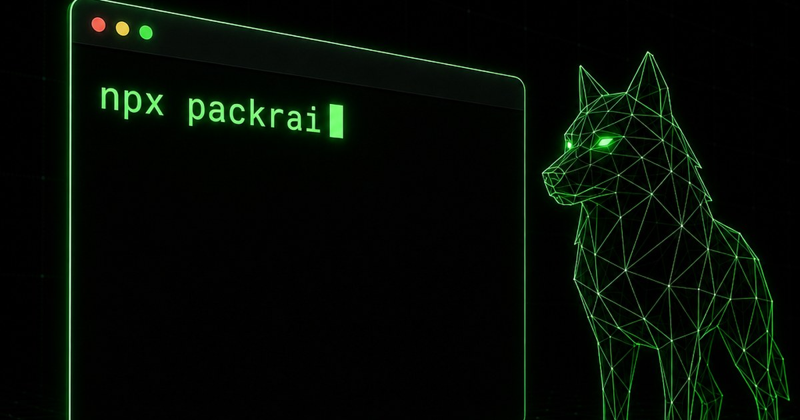
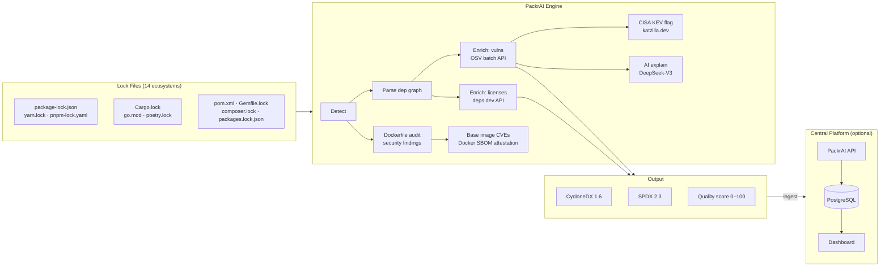
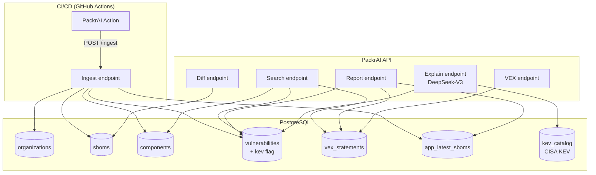

<div align="center">
  

  <h1>PackrAI</h1>

  <p><strong>Generate accurate, compliant SBOMs from any project — in one command.</strong></p>

  [](https://www.npmjs.com/package/packrai)
  [](https://github.com/RunTimeAdmin/PACKRAI/actions/workflows/ci.yml)
  [](https://github.com/RunTimeAdmin/PACKRAI/actions/workflows/sbom.yml)
  [](LICENSE)
  [](https://cyclonedx.org)
  [](https://spdx.dev)
</div>

```bash
npx packrai RunTimeAdmin/myapp@v2.1.0
```

Produces **CycloneDX 1.6**, **SPDX 2.3**, and an **AI Bill of Materials** in under 500ms. No Docker. No agents. No config files.

---

## Quick Start

```bash
# Scan a GitHub repo at a specific tag
npx packrai owner/repo@v1.2.0

# Scan the current directory
npx packrai .

# Scan a local directory
npx packrai ./my-project

# Private repo (uses $GITHUB_TOKEN automatically)
npx packrai owner/private-repo

# Diff two SBOMs — see what changed between releases
npx packrai diff old.cyclonedx.json new.cyclonedx.json

# Check for forbidden/restricted licenses
npx packrai . --license-check

# Skip vulnerability lookup (faster, offline-safe)
npx packrai owner/repo --no-vulns

# AI remediation advice — explains vulns and produces a prioritised fix plan
DEEPSEEK_API_KEY=<your-deepseek-key> npx packrai . --explain

# AI explain with CISA KEV context — flags actively-exploited vulns
DEEPSEEK_API_KEY=<your-deepseek-key> KATZILLA_API_KEY=<your-katzilla-key> npx packrai . --explain
```

Output files written to the current directory:
```
bom.cyclonedx.json   ← CycloneDX 1.6
bom.spdx.json        ← SPDX 2.3
```

---

## How It Works



Lock files are the resolved dependency graph — authoritative, deterministic, and exact. PackrAI reads them directly instead of walking the filesystem, which is why it's 60–187× faster than Syft and Trivy on equivalent repos.

---

## Why PackrAI

| | PackrAI | Syft | Trivy |
|---|---|---|---|
| **Speed** | **250–465ms** | 9–28s | 10–87s |
| **Approach** | Lock-file parsing | Filesystem scan | Filesystem + image scan |
| **Transitives** | Full graph | Partial | Partial |
| **Dep graph** | ✅ | ✅ | ❌ |
| **Zero config** | ✅ | ❌ | ❌ |
| **GitHub URL** | ✅ | ❌ | ❌ |
| **SBOM diff** | ✅ | ❌ | ❌ |
| **License policy** | ✅ | ❌ | ❌ |
| **VEX support** | ✅ | ❌ | ❌ |
| **Central repo** | ✅ | ❌ | ❌ |
| **CISA KEV flag** | ✅ | ❌ | ❌ |
| **AI remediation** | ✅ | ❌ | ❌ |
| **Dockerfile audit** | ✅ | ❌ | ❌ |
| **Base image CVEs** | ✅ (no Docker) | ❌ | ✅ (requires Docker) |

### Benchmark Results

| Repo | Ecosystem | PackrAI | Syft | Trivy |
|------|-----------|---------|------|-------|
| `nestjs/nest` | npm | **463ms** | 27 731ms | 86 550ms |
| `psf/requests` | Python | **251ms** | 9 330ms | 10 502ms |
| `BurntSushi/ripgrep` | Rust | **268ms** | 11 823ms | 15 425ms |

Syft and Trivy run via Docker in this benchmark, adding ~3–5s of startup overhead. Native installs would be somewhat faster — but still an order of magnitude slower on lock-file repos. Reproduce with `npm run bench`.

---

## AI Bill of Materials (AI-BOM)

PackrAI extends its SBOM pipeline with a full **AI Bill of Materials** — a signed, hash-chained attestation covering every layer of an AI/ML project. Runs automatically alongside the SBOM scan; no extra flags required for basic detection.

```bash
npx packrai .                          # auto-detects AI components
npx packrai . --no-aibom              # skip AI-BOM if not needed
npx packrai . --no-aibom-enrich       # local detection only, no HuggingFace Hub calls
```

Output files:
```
bom.cyclonedx.json   ← SBOM + AI components embedded (modelCard, datasets, compositions)
bom.spdx.json        ← standard SPDX output
aibom.json           ← standalone AI-BOM attestation (lineage, signature, compliance)
```

### Pillar 1 — Model Provenance
Detects model weights (`*.safetensors`, `*.gguf`, `*.onnx`, `*.bin`), computes **streaming SHA-256** hashes (up to 2 GB per file), and reads `config.json` to extract architecture, parameter count, context length, and precision. HuggingFace model IDs found in Python source files and environment variables are resolved via the Hub API for commit-level provenance.

```json
{
  "type": "machine-learning-model",
  "name": "meta-llama/Llama-3.1-8B",
  "purl": "pkg:huggingface/meta-llama/Llama-3.1-8B@main",
  "hashes": [
    { "alg": "SHA-256", "content": "a3f9..." },
    { "alg": "SHA-1",   "content": "d4c2..." }
  ],
  "modelCard": {
    "modelParameters": {
      "architectureFamily": "Transformer",
      "modelArchitecture": "Decoder-only LLM",
      "task": { "type": "natural-language-processing" },
      "datasets": [{ "bom-ref": "pkg:huggingface/dataset/allenai/c4@unknown" }]
    }
  }
}
```

### Pillar 2 — Data Lineage
Datasets referenced in `config.json`, HuggingFace model cards, and Hub metadata become standalone `type: data` components with HuggingFace PURLs and governance records. The `modelCard.modelParameters.datasets` array links to them by `bom-ref` — no duplicated metadata.

```json
{
  "type": "data",
  "name": "allenai/c4",
  "purl": "pkg:huggingface/dataset/allenai/c4@unknown",
  "data": [{
    "type": "dataset",
    "contents": { "url": "https://huggingface.co/datasets/allenai/c4" },
    "governance": { "owners": [{ "contact": { "name": "allenai" } }] }
  }]
}
```

### Pillar 3 — Infrastructure & Frameworks
50+ AI/ML Python packages (PyTorch, TensorFlow, JAX, Transformers, vLLM, LangChain, LlamaIndex, etc.) are classified by role (`training-framework`, `inference-engine`, `orchestration`, `vector-store`, and more). Detected versions are captured directly from the lock file — no runtime required.

### Pillar 4 — Agentic Context (MCP)
Scans for MCP server configurations (`.cursor/mcp.json`, `.vscode/mcp.json`, `mcp.json`, etc.) and system prompt files (`CLAUDE.md`, `.cursorrules`, `.clinerules`, `*.prompt`, `*.prompty`). Each MCP server is analysed for:

| Flag | Threat |
|------|--------|
| `shellAccess` | Command execution capability → `AI-009 EXCESSIVE_AGENCY` |
| `broadFilesystem` | Root-level path access → `AI-009 EXCESSIVE_AGENCY` |
| `unpinnedSource` | `npx -y` or unversioned package → `AI-010 UNPINNED_MCP` |
| Remote transport (SSE/HTTP) without auth | `AI-011 UNAUTHENTICATED_REMOTE` |
| Prompt files present | `AI-012 PROMPT_TAMPERING` (hash-locked) |

A **Least Agency Score** (0–100) is computed from the aggregate authority surface and included in the scan summary.

### Pillar 5 — Governance & Compliance
`aibom.json` includes a **compliance assessment** mapped to:

| Control | Standard | Satisfied when |
|---------|----------|----------------|
| `ISO42001:A.6.1.1` | ISO/IEC 42001:2023 | AI components inventoried |
| `ISO42001:A.6.2.6` | ISO/IEC 42001:2023 | Training data documented |
| `ISO42001:A.6.2.8` | ISO/IEC 42001:2023 | Agentic authority scope declared |
| `EUAIACT:Art53.1a` | EU AI Act Art. 53 | Model architecture documented |
| `EUAIACT:Art53.1c` | EU AI Act Art. 53 | Dataset licenses inventoried |
| `EUAIACT:Art53.1d` | EU AI Act Art. 53 | Training datasets listed |

### Hash-Chained Lineage
Every AI-BOM includes a tamper-evident chain linking stages from base model through fine-tune → quantize → evaluation → package → deploy. Each record carries a `prevHash` and a `recordHash` (SHA-256 of the canonicalised content), detectable by `verifyAIBomDocument()`.

### Cryptographic Signing
AI-BOMs can be signed with Ed25519 (always available) and optionally **ML-DSA-65 / SLH-DSA** (post-quantum, requires OpenSSL 3.5+). The signature uses JSON Signature Format (JSF) over RFC 8785 canonicalised content and is attached to the CycloneDX `signature` field. When PQC is unavailable, the document honestly records `pqc: { status: "unavailable", reason: "..." }` rather than silently omitting it.

```bash
# Pass signing keys via environment or config
PACKRAI_SIGNING_KEY=./ed25519.pem npx packrai .
```

### Threat Detection
| ID | Threat | Trigger |
|----|--------|---------|
| `AI-001` | `UNSAFE_PICKLE` | `.pkl`/`.pickle` weight files |
| `AI-002` | `UNSAFE_SAFETENSORS` | safetensors format issues |
| `AI-003` | `NO_PROVENANCE` | no Hub metadata resolvable |
| `AI-004` | `ADVERSARIAL_INPUT` | adversarial-robustness packages present |
| `AI-005` | `DATA_POISONING` | no training data documented |
| `AI-006` | `COMPROMISED_PRETRAINED` | no integrity hash on weights |
| `AI-007` | `RESTRICTED_LICENSE` | dataset under non-commercial license |
| `AI-008` | `TELEMETRY_EXFIL` | analytics/telemetry packages detected |
| `AI-009` | `EXCESSIVE_AGENCY` | MCP shell or broad filesystem access |
| `AI-010` | `UNPINNED_MCP` | MCP server without pinned version |
| `AI-011` | `UNAUTHENTICATED_REMOTE` | remote MCP transport, no auth |
| `AI-012` | `PROMPT_TAMPERING` | prompt files detected (hash-locked) |

### CycloneDX 1.7 opt-in
The default output is CycloneDX **1.6** for maximum toolchain compatibility. Pass `specVersion: '1.7'` in the API or `--spec-version 1.7` on the CLI to enable the full 1.7 ML-BOM `modelCard` schema including `quantitativeAnalysis` and richer `considerations`.

---

## Features

### SBOM Generation
Produces fully-spec-compliant CycloneDX 1.6 and SPDX 2.3 with all CISA 2025 minimum elements: component name, version, supplier, purl, cryptographic hashes, license identifiers, dependency relationships, author, timestamp, and tool metadata.

### Vulnerability Enrichment
Every component is checked against the [OSV database](https://osv.dev) in a single batch call. Severity, CVSS score, and fix version are included in the SBOM output.

### License Compliance
```bash
npx packrai . --license-check
```
Categorises each component's license as **permissive**, **notice**, **restricted** (weak copyleft — review required), or **forbidden** (strong copyleft). Exits `1` if any forbidden license is found. Produces a license compliance score 0–100.

### SBOM Diffing
```bash
npx packrai diff v1.0.0.cyclonedx.json v1.1.0.cyclonedx.json
```
Shows exactly what changed between two releases: components added/removed/updated, and new or resolved vulnerabilities. Exits `1` if new vulnerabilities were introduced. Available both as a CLI command and via the API (`GET /api/v1/apps/:name/diff`).

### VEX Support
Mark vulnerabilities as `not_affected`, `fixed`, `affected`, or `under_investigation` via the API. `not_affected` statements suppress vulns from risk reports, keeping dashboards signal-rich.

### CISA KEV Enrichment
Every vulnerability is automatically cross-referenced against the [CISA Known Exploited Vulnerabilities catalog](https://www.cisa.gov/known-exploited-vulnerabilities-catalog) (1,600+ entries, refreshed daily). Vulns on the KEV list are flagged `kev: true` in the database and surfaced in the AI explain output as highest priority — because being actively exploited in the wild is categorically different from a theoretical CVSS score.

Requires `KATZILLA_API_KEY` ([katzilla.dev](https://katzilla.dev)). The catalog is fetched once at API startup then refreshed every 24 hours. New vulns are cross-referenced immediately at ingest time without waiting for the refresh cycle.

### AI Remediation Advice
```bash
DEEPSEEK_API_KEY=<your-deepseek-key> npx packrai . --explain
```
After scanning, sends your vulnerability list to [DeepSeek-V3](https://platform.deepseek.com) and returns:
- 2–3 sentence plain-English risk summary
- Prioritised upgrade plan ordered by impact (most vulns resolved per change first)
- Specific mitigation guidance for vulns with no fix available
- CISA KEV callouts for actively-exploited entries

Available both as a CLI flag (`--explain`) and as a REST endpoint (`POST /api/v1/apps/:name/explain`). Requires `DEEPSEEK_API_KEY`. The API endpoint returns `501` if the key is not configured, so it degrades gracefully.

### Dockerfile Security Audit

PackrAI automatically detects and audits every `Dockerfile` in your project tree (including `Dockerfile.prod`, `Dockerfile.dev`, etc.) and reports security findings alongside the SBOM:

| Rule | Severity | What it catches |
|------|----------|-----------------|
| `unpinned-base-image` | HIGH | `:latest` tag or no tag |
| `no-digest-pin` | MEDIUM | tag present but no `@sha256:...` digest |
| `explicit-root-user` | HIGH | `USER root` or `USER 0` |
| `no-user-directive` | MEDIUM | no `USER` directive (defaults to root) |
| `secret-in-env` | HIGH | `ENV`/`ARG` with password/token/secret keyword |
| `add-instead-of-copy` | LOW | `ADD` used for plain file copies |
| `no-healthcheck` | LOW | no `HEALTHCHECK` directive |

Multi-stage builds are detected. Use `--no-docker` to skip Dockerfile scanning entirely.

### Base Image CVE Lookup

For Docker Official Images (`node`, `nginx`, `python`, `ubuntu`, etc.), PackrAI pulls the SBOM attestation directly from the Docker Hub OCI registry and queries OSV for known CVEs — with no Docker installation required.

```
Dockerfile  ·  2 MEDIUM  1 LOW  · multi-stage
  [MEDIUM] no-digest-pin:1  Base image 'node:20-alpine' has no digest pin
  base: node:20-alpine  ·  32 CVEs
32 base-image CVEs
```

How it works:
1. Anonymous OAuth token from Docker Hub auth service
2. Fetch the OCI image index (multi-platform manifest list)
3. Locate the linux/amd64 SBOM attestation entry
4. Pull the in-toto statement blob containing the SPDX 2.3 package list
5. Batch-query OSV for CVEs across all OS packages

Base image components appear in the CycloneDX output as `type: container` with `pkg:docker/library/node@20-alpine` PURLs. If no SBOM attestation is available (private or older images), the lookup returns `no CVE data` gracefully without failing the pipeline.

### Quality Score
Every SBOM gets a completeness score (0–100) measuring alignment with CISA 2025 minimum elements: purl coverage, hash coverage, license coverage, and lock-file fidelity.

---

## GitHub Action

```yaml
name: SBOM

on:
  push:
    branches: [main]
  pull_request:

permissions:
  contents: read
  pull-requests: write

jobs:
  sbom:
    runs-on: ubuntu-latest
    steps:
      - uses: actions/checkout@v4

      - name: PackrAI
        uses: RunTimeAdmin/PACKRAI@v1
        with:
          format: both
          fail-on-critical: true
          upload-artifact: true
```

On every pull request, PackrAI will:
- Generate CycloneDX 1.6 + SPDX 2.3 SBOMs
- Post a summary comment to the PR with vulnerability count and quality score
- Upload SBOMs as artifacts with 90-day retention
- Block merge if critical vulnerabilities are found

### Action Inputs

| Input | Default | Description |
|-------|---------|-------------|
| `format` | `both` | `both` · `cyclonedx` · `spdx` |
| `output-dir` | `sbom` | Directory to write SBOM files |
| `fail-on-critical` | `true` | Exit 1 if critical vulnerabilities found |
| `upload-artifact` | `true` | Upload SBOMs as GitHub Actions artifacts |
| `skip-vulns` | `false` | Skip OSV enrichment (faster, offline-safe) |
| `api-url` | `""` | PackrAI central API endpoint |
| `api-key` | `""` | PackrAI API key (`secrets.PACKRAI_API_KEY`) |
| `directory` | `.` | Directory to scan |

### Action Outputs

| Output | Description |
|--------|-------------|
| `cyclonedx-path` | Path to generated CycloneDX 1.6 BOM |
| `spdx-path` | Path to generated SPDX 2.3 BOM |
| `component-count` | Total components enumerated |
| `vulnerability-count` | Total known vulnerabilities |
| `critical-count` | Critical severity vulnerabilities (CVSS ≥ 9.0) |
| `quality-score` | SBOM completeness score 0–100 |

### With Central Tracking

```yaml
      - name: PackrAI
        uses: RunTimeAdmin/PACKRAI@v1
        with:
          format: both
          fail-on-critical: true
          upload-artifact: true
          api-url: ${{ vars.PACKRAI_API_URL }}
          api-key: ${{ secrets.PACKRAI_API_KEY }}
```

When `api-url` and `api-key` are set, SBOMs are automatically pushed to your PackrAI central instance for org-wide tracking. Upload failures do not fail the build.

---

## Supported Ecosystems

| Ecosystem | Lock File | Transitives | Notes |
|-----------|-----------|-------------|-------|
| **npm** | `package-lock.json` v1/v2/v3 | ✅ Full graph | Hoisting-aware resolver |
| **npm** | `pnpm-lock.yaml` v6/v9 | ✅ Full graph | Peer suffix handling |
| **npm** | `yarn.lock` v1 | ✅ Full graph | |
| **Python** | `poetry.lock` | ✅ Full graph | |
| **Python** | `Pipfile.lock` | ✅ Full graph | |
| **Python** | `requirements.txt` | ⚠️ Direct only | Warns on missing transitives |
| **Rust** | `Cargo.lock` | ✅ Full graph | SHA-256 checksums |
| **Go** | `go.mod` + `go.sum` | ✅ Full graph | Direct/indirect detection |
| **Java** | `pom.xml` | ✅ + `mvn` transitives | Resolves `${property}` vars |
| **Java** | `gradle.lockfile` | ✅ Full graph | Requires `--write-locks` |
| **.NET** | `packages.lock.json` | ✅ Full graph | SHA-512 hashes |
| **Ruby** | `Gemfile.lock` | ✅ Full graph | SHA-1 checksums via Bundler |
| **PHP** | `composer.lock` | ✅ Full graph | Licenses from package metadata |
| **Swift** | `Package.resolved` | ⚠️ Direct only | Git SHA hashes |
| **Dart/Flutter** | `pubspec.lock` | ⚠️ Direct only | SHA-256 hashes |

Monorepos are supported — PackrAI recurses up to 4 directories deep and deduplicates lock files per directory.

---

## CLI Reference

```
packrai <source> [options]
packrai diff <from> <to> [options]

Arguments:
  source                Local path, owner/repo[@ref], or https://github.com/... URL

Scan options:
  -o, --out <dir>       Output directory (default: current directory)
  -n, --name <name>     Project name override
  -v, --ver <version>   Version override
  -a, --author <org>    Author or organisation name
  --token <token>       GitHub token for private repos (or set $GITHUB_TOKEN)
  --format <fmt>        both | cyclonedx | spdx  (default: both)
  --license-check       Flag forbidden/restricted licenses; exit 1 if any found
  --explain             AI remediation advice via DeepSeek-V3 (requires DEEPSEEK_API_KEY)
  --no-vulns            Skip OSV vulnerability enrichment
  --no-licenses         Skip deps.dev license enrichment
  --no-docker           Skip Dockerfile audit and base image CVE lookup
  --no-recursive        Do not recurse into subdirectories
  --json                Print summary as JSON (machine-readable, for CI)

Diff options:
  --json                Machine-readable JSON diff output
```

### Exit Codes

| Code | Meaning |
|------|---------|
| `0` | Success |
| `1` | Critical vulnerabilities found, or forbidden license detected (`--license-check`) |
| `2` | Fatal error — no lock files, clone failed, or unrecoverable parse error |

---

## Output Formats

### CycloneDX 1.6
```json
{
  "bomFormat": "CycloneDX",
  "specVersion": "1.6",
  "components": [
    {
      "type": "library",
      "name": "express",
      "version": "4.18.2",
      "purl": "pkg:npm/express@4.18.2",
      "licenses": [{ "license": { "id": "MIT" } }],
      "hashes": [{ "alg": "SHA-512", "content": "..." }],
      "scope": "required"
    }
  ],
  "dependencies": [
    { "ref": "pkg:npm/express@4.18.2", "dependsOn": ["pkg:npm/accepts@1.3.8"] }
  ],
  "vulnerabilities": [
    {
      "id": "GHSA-rv95-896h-c2vc",
      "ratings": [{ "score": 7.5, "severity": "high", "method": "CVSSv3" }],
      "affects": [{ "ref": "pkg:npm/express@4.18.2" }]
    }
  ]
}
```

### SPDX 2.3
```json
{
  "spdxVersion": "SPDX-2.3",
  "packages": [...],
  "relationships": [
    {
      "spdxElementId": "SPDXRef-express-4.18.2",
      "relationshipType": "DEPENDS_ON",
      "relatedSpdxElement": "SPDXRef-accepts-1.3.8"
    }
  ]
}
```

Both formats include all CISA 2025 minimum elements, full transitive dependency relationships, cryptographic hashes, SPDX license identifiers, and OSV vulnerability data.

---

## Central Platform (Self-Hosted)

The PackrAI API server answers org-wide questions like:

> "Which of our apps are exposed to CVE-2021-44228, and do any of them have a fix available?"



### Start the API

```bash
# With Docker (recommended)
cp .env.example .env      # set HMAC_SECRET and POSTGRES_PASSWORD
docker compose up -d
```

API available at `http://localhost:3080`.

### Key Endpoints

| Method | Path | Description |
|--------|------|-------------|
| `POST` | `/api/v1/ingest` | Ingest a new SBOM (called by the Action) |
| `GET` | `/api/v1/apps` | List all apps with risk summary |
| `GET` | `/api/v1/apps/:name/diff` | Diff latest two SBOMs for an app |
| `GET` | `/api/v1/search?cve=CVE-...` | Which apps are exposed to this CVE? |
| `GET` | `/api/v1/report` | Org-wide risk report |
| `POST` | `/api/v1/apps/:name/explain` | AI vulnerability summary + remediation plan |
| `POST` | `/api/v1/vex` | Add a VEX statement |
| `GET` | `/api/v1/vex` | List VEX statements |
| `POST` | `/api/v1/keys` | Issue a scoped API key |

See [`src/api/schema.sql`](src/api/schema.sql) for the full database schema.

---

## Development

```bash
git clone https://github.com/RunTimeAdmin/PACKRAI
cd PACKRAI
npm install

npm test          # unit tests (66 tests, no external deps)
npm run e2e       # integration tests (requires docker compose up -d)
npm run bench     # benchmark vs Syft and Trivy
node bin/packrai.js . --no-vulns   # run the CLI locally
```

### Project Structure

```
packrai/
├── bin/packrai.js          CLI entry point (scan + diff subcommands)
├── src/
│   ├── pipeline.js         Orchestration: detect → parse → enrich → generate
│   ├── diff.js             SBOM diffing: components and vulnerabilities
│   ├── licensePolicy.js    License tier classification and compliance scoring
│   ├── component.js        Shared component model + purl generation
│   ├── github.js           GitHub URL parsing + shallow clone
│   ├── osv.js              OSV vulnerability enrichment (batch API)
│   ├── kev.js              CISA KEV catalog sync (katzilla.dev, daily refresh)
│   ├── explain.js          AI remediation advice (DeepSeek-V3 via OpenAI SDK)
│   ├── licenses.js         License enrichment (deps.dev API)
│   ├── basevuln.js         Base image CVE lookup via Docker SBOM attestations (OCI + OSV)
│   ├── parsers/
│   │   ├── npm.js          package-lock.json v1/v2/v3, yarn.lock
│   │   ├── pnpm.js         pnpm-lock.yaml v6/v9
│   │   ├── python.js       poetry.lock, Pipfile.lock, requirements.txt
│   │   ├── cargo.js        Cargo.lock
│   │   ├── golang.js       go.mod + go.sum
│   │   ├── maven.js        pom.xml
│   │   ├── gradle.js       gradle.lockfile
│   │   ├── dotnet.js       packages.lock.json (NuGet)
│   │   ├── ruby.js         Gemfile.lock
│   │   ├── php.js          composer.lock
│   │   ├── swift.js        Package.resolved
│   │   ├── dart.js         pubspec.lock
│   │   ├── detect.js       Lock file detection + deduplication; Dockerfile discovery
│   │   ├── dockerfile.js   Dockerfile static security audit (7 rules, no Docker required)
│   │   └── index.js        Parser dispatcher
│   ├── generators/
│   │   ├── cyclonedx.js    CycloneDX 1.6 generator + validator
│   │   └── spdx.js         SPDX 2.3 generator
│   └── api/
│       ├── server.js       Express API server
│       ├── db.js           PostgreSQL connection pool + transaction helper
│       └── schema.sql      Database schema
├── deploy/
│   ├── migrate_001_app_latest_sboms.sql
│   ├── migrate_002_vex.sql
│   └── docker-compose.yml  API + Postgres production stack
├── tests/
│   ├── parsers.test.js     Parser unit tests
│   └── fixtures/           Sample lock files (all 14 ecosystems)
├── examples/
│   └── github-workflow.yml Annotated copy-paste workflow
└── action.yml              GitHub Action definition
```

### Adding a New Ecosystem

1. Write `src/parsers/<ecosystem>.js` — export a `parse*` function returning `Component[]`
2. Add detection entry in `src/parsers/detect.js` (`LOCK_FILE_BY_NAME`)
3. Add dispatcher case in `src/parsers/index.js`
4. Add `case '<ecosystem>'` in `src/component.js` `makePurl()`
5. Add fixture in `tests/fixtures/` and tests in `tests/parsers.test.js`

---

## Standards Compliance

| Standard | Version | Status |
|----------|---------|--------|
| [CycloneDX](https://cyclonedx.org/specification/overview/) | 1.6 | ✅ Full |
| [SPDX](https://spdx.dev/specifications/) | 2.3 | ✅ Full |
| [NTIA Minimum Elements](https://www.ntia.gov/report/2021/minimum-elements-software-bill-materials-sbom) | 2021 | ✅ All 7 fields |
| [CISA Minimum Elements](https://www.cisa.gov/resources-tools/resources/software-bill-materials-sbom) | 2025 | ✅ purl, hashes, licenses, relationships, metadata |
| [EO 14028](https://www.whitehouse.gov/briefing-room/presidential-actions/2021/05/12/executive-order-on-improving-the-nations-cybersecurity/) | — | ✅ Supply chain security |
| [OpenVEX / CycloneDX VEX](https://www.cisa.gov/sites/default/files/2023-04/minimum-requirements-for-vex_508c.pdf) | — | ✅ Via API |

---

## Known Limitations

PackrAI is a **lock-file-first** SBOM generator. This makes it fast and deterministic, but it does not replace container or filesystem scanners for all use cases.

| Area | Detail |
|------|--------|
| **Container/image scanning** | Dockerfile static audit + base image CVE lookup via SBOM attestation (no Docker required). Does not walk running container layers or produce a full container SBOM. Use Trivy for full container image analysis. |
| **Compiled binaries** | SBOMs are generated from lock files, not compiled output or vendored binaries. |
| **No lock file → no SBOM** | `requirements.txt` produces direct-only output with a warning. Projects without any committed lock file are not supported. |
| **Java (Maven)** | Transitive resolution requires `mvn` to be installed locally. Without it, direct deps only. |
| **Swift / Dart** | Flat resolved set only — no dependency graph available in the lock file format. |
| **Gradle** | Requires `--write-locks` to produce `gradle.lockfile`. |
| **.NET** | Requires `RestorePackagesWithLockFile=true` and a committed `packages.lock.json`. |

---

## License

MIT — see [LICENSE](LICENSE)
